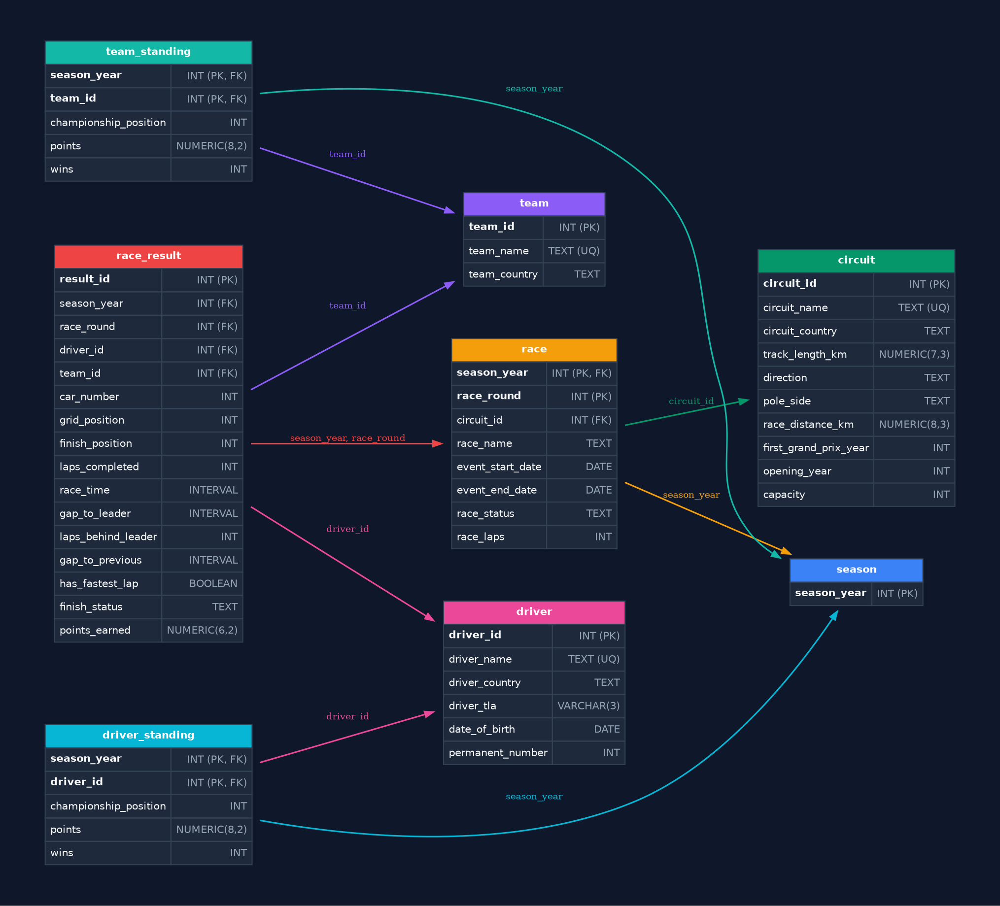
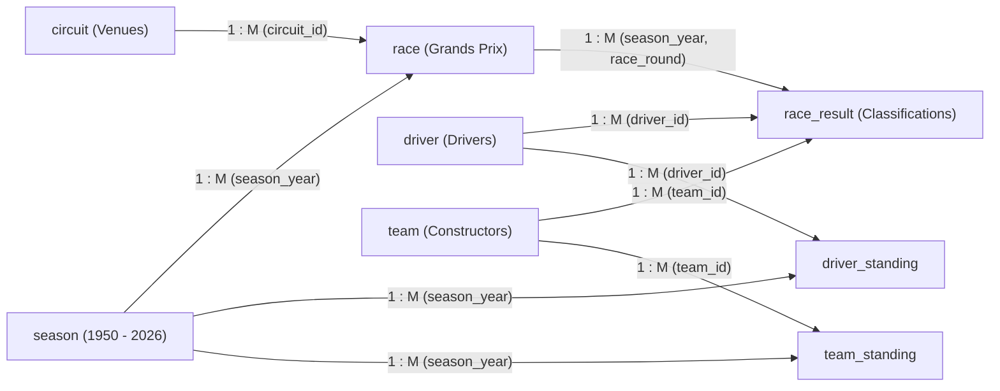

# f1-history-database

[](https://www.postgresql.org/) []() []() []()

> Enterprise-grade, normalized relational PostgreSQL database modeling the complete history of the FIA Formula 1 World Championship (1950 – 2026).

---

## 1. Overview

**f1-history-database** models the complete history of the FIA Formula 1 World Championship from the inaugural 1950 British Grand Prix at Silverstone through the 2024 championship, including scheduled race calendars extending into 2026.

Every race classification, starting grid spot, lap count, microsecond interval gap, fastest lap flag, championship standing, circuit technical specification, constructor profile, and driver biography has been cleaned, structured, and normalized into a Third Normal Form (3NF) relational model.

### Key Highlights
* **Comprehensive Historical Span**: Covers 75 completed World Championship seasons (1950 to 2024) plus official calendars through 2026.
* **Complete Race Classifications**: 27,358 classified driver results across 1,171 official Grands Prix.
* **Microsecond Timing Precision**: Preserves exact total race elapsed times for race winners and microsecond intervals / lap deficits for classified finishers using native PostgreSQL `INTERVAL` types.
* **Championship Standings**: 3,224 Driver Championship standing records and 1,704 Constructor Championship standing records.
* **Turnkey PostgreSQL Backup**: Provided as a single, compressed binary backup archive (`f1_database.backup`) ready for immediate restoration into any local, cloud, or Dockerized PostgreSQL instance.
* **Strict Quality Verification**: Validated by 7 automated test suites testing column nullability, referential integrity, domain constraints, historical facts, and cross-table statistical coherence with 0 defects.

### Repository Structure

```text
.
├── .gitignore              # Git ignore rules for system and editor artifacts
├── README.md               # Complete database documentation, schema specifications & queries
├── f1_database.backup      # PostgreSQL Custom Archive binary backup (schema + 35,085 records)
└── media/
    └── schema_diagram.png  # High-resolution entity-relationship diagram
```

> [!IMPORTANT]
> This database is engineered exclusively for **PostgreSQL** (version 14, 15, 16, or higher).
> It utilizes native PostgreSQL engine capabilities—including `INTERVAL` types, `GENERATED BY DEFAULT AS IDENTITY` sequences, native `BOOLEAN` types, and multi-column check constraints—that are incompatible with Microsoft SQL Server (T-SQL), MySQL, or SQLite without manual dialect conversion.

---

## 2. Database Structure

The schema adheres strictly to Third Normal Form (3NF) principles:
* Every non-key column is fully and functionally dependent solely on the primary key (no transitive dependencies).
* Entity attributes are cleanly separated across primary entities (`season`, `circuit`, `team`, `driver`), transactional event entities (`race`, `race_result`), and end-of-season aggregations (`driver_standing`, `team_standing`).
* Relationships are reinforced with explicit foreign keys, cascading update/delete rules, and B-Tree indexes.

### Foreign Key Topology & Cascading Rules
* `race.season_year` -> `season.season_year` (`ON UPDATE CASCADE ON DELETE CASCADE`)
* `race.circuit_id` -> `circuit.circuit_id` (`ON UPDATE CASCADE ON DELETE RESTRICT`)
* `race_result.(season_year, race_round)` -> `race.(season_year, race_round)` (`ON UPDATE CASCADE ON DELETE CASCADE`)
* `race_result.driver_id` -> `driver.driver_id` (`ON UPDATE CASCADE ON DELETE RESTRICT`)
* `race_result.team_id` -> `team.team_id` (`ON UPDATE CASCADE ON DELETE RESTRICT`)
* `driver_standing.season_year` -> `season.season_year` (`ON UPDATE CASCADE ON DELETE CASCADE`)
* `driver_standing.driver_id` -> `driver.driver_id` (`ON UPDATE CASCADE ON DELETE RESTRICT`)
* `team_standing.season_year` -> `season.season_year` (`ON UPDATE CASCADE ON DELETE CASCADE`)
* `team_standing.team_id` -> `team.team_id` (`ON UPDATE CASCADE ON DELETE RESTRICT`)

---

## 3. Entities and Tables

The database consists of 8 tables containing a total of 35,085 records:

### 3.1 Table: `season`
Stores every Formula 1 World Championship season from 1950 to the present.

* **Primary Key**: `season_year`
* **Record Count**: 77 seasons (1950 to 2026)

| Column Name | Data Type | Nullable | Constraints | Description |
| :--- | :--- | :---: | :--- | :--- |
| `season_year` | `INTEGER` | NO | PK, CHECK (1950..2030) | Calendar year of the World Championship season. |

---

### 3.2 Table: `circuit`
Stores historical and modern racing circuits, road courses, and street venues.

* **Primary Key**: `circuit_id`
* **Candidate Unique Key**: `circuit_name`
* **Record Count**: 80 canonical circuits

| Column Name | Data Type | Nullable | Constraints | Description |
| :--- | :--- | :---: | :--- | :--- |
| `circuit_id` | `INTEGER` | NO | PK (IDENTITY) | Internal surrogate identifier for the circuit. |
| `circuit_name` | `TEXT` | NO | UNIQUE | Official unique track name (e.g. Silverstone Circuit, Circuit de Monaco). |
| `circuit_country` | `TEXT` | NO | | Sovereign nation in which the circuit is located. |
| `track_length_km` | `NUMERIC(7,3)` | YES | CHECK (> 0) | Lap distance in kilometers. NULL for historical tracks lacking official specs. |
| `direction` | `TEXT` | YES | | Racing direction: `clockwise` or `anticlockwise`. |
| `pole_side` | `TEXT` | YES | | Starting side of pole position driver: `left` or `right`. |
| `race_distance_km`| `NUMERIC(8,3)` | YES | CHECK (> 0) | Scheduled Grand Prix distance in kilometers (~305 km modern standard). |
| `first_grand_prix_year` | `INTEGER` | YES | | Calendar year the circuit hosted its inaugural World Championship Grand Prix. |
| `opening_year` | `INTEGER` | YES | | Calendar year the venue was originally constructed. |
| `capacity` | `INTEGER` | YES | CHECK (>= 0) | Total spectator capacity for modern permanent venues. |

---

### 3.3 Table: `team`
Stores constructor teams, chassis manufacturers, and historical privateer entrants.

* **Primary Key**: `team_id`
* **Candidate Unique Key**: `team_name`
* **Record Count**: 538 constructors and historical entrants

| Column Name | Data Type | Nullable | Constraints | Description |
| :--- | :--- | :---: | :--- | :--- |
| `team_id` | `INTEGER` | NO | PK (IDENTITY) | Internal surrogate identifier for the team. |
| `team_name` | `TEXT` | NO | UNIQUE | Standardized constructor name (e.g. Ferrari, McLaren, Williams, Mercedes). |
| `team_country` | `TEXT` | YES | | Country of origin or racing license. NULL for historical privateer entries. |

---

### 3.4 Table: `driver`
Stores every driver who participated in an official World Championship session.

* **Primary Key**: `driver_id`
* **Candidate Unique Key**: `driver_name`
* **Record Count**: 933 drivers (100% date-of-birth completeness)

| Column Name | Data Type | Nullable | Constraints | Description |
| :--- | :--- | :---: | :--- | :--- |
| `driver_id` | `INTEGER` | NO | PK (IDENTITY) | Internal surrogate identifier for the driver. |
| `driver_name` | `TEXT` | NO | UNIQUE | Full driver name (e.g. Lewis Hamilton, Michael Schumacher, Ayrton Senna). |
| `driver_country` | `TEXT` | NO | | Driver nationality / racing license country. |
| `driver_tla` | `VARCHAR(3)`| YES | CHECK (^[A-Z]{3}$) | FIA 3-letter timing code (e.g. HAM, VER). Instituted in 2004; NULL for pre-2004 drivers. |
| `date_of_birth` | `DATE` | NO | CHECK (< TODAY) | Driver date of birth. 100% populated across all 933 drivers. |
| `permanent_number` | `INTEGER`| YES | CHECK (1..99) | Career driver number instituted in 2014 (#44, #33). NULL for pre-2014 drivers. |

---

### 3.5 Table: `race`
Stores every Grand Prix event held across each championship season.

* **Primary Key**: `(season_year, race_round)`
* **Record Count**: 1,171 races

| Column Name | Data Type | Nullable | Constraints | Description |
| :--- | :--- | :---: | :--- | :--- |
| `season_year` | `INTEGER` | NO | PK, FK -> `season` | The championship year of the event. |
| `race_round` | `INTEGER` | NO | PK, CHECK (> 0) | Sequential round number within that championship season (1, 2, ...). |
| `circuit_id` | `INTEGER` | NO | FK -> `circuit` | Circuit where the Grand Prix took place. |
| `race_name` | `TEXT` | NO | | Official Grand Prix title (e.g. Italian Grand Prix, Belgian Grand Prix). |
| `event_start_date` | `DATE` | NO | | Start date of the race weekend event. |
| `event_end_date` | `DATE` | NO | CHECK (>= start) | Final race day date. |
| `race_status` | `TEXT` | YES | | Operational status (`Finished`, `Next`). NULL for future unconfirmed rounds. |
| `race_laps` | `INTEGER` | YES | CHECK (> 0) | Total scheduled or completed laps of the Grand Prix. |

---

### 3.6 Table: `race_result`
Stores driver classifications, starting grid spots, intervals, times, fastest lap, and points.

* **Primary Key**: `result_id`
* **Candidate Unique Key**: `(season_year, race_round, driver_id)`
* **Record Count**: 27,358 classified results

| Column Name | Data Type | Nullable | Constraints | Description |
| :--- | :--- | :---: | :--- | :--- |
| `result_id` | `INTEGER` | NO | PK (IDENTITY) | Internal surrogate identifier for the result. |
| `season_year` | `INTEGER` | NO | FK -> `race` | Championship year of the event. |
| `race_round` | `INTEGER` | NO | FK -> `race` | Round number within the season. |
| `driver_id` | `INTEGER` | NO | FK -> `driver` | Foreign key referencing the participating driver. |
| `team_id` | `INTEGER` | NO | FK -> `team` | Foreign key referencing the constructor entity. |
| `car_number` | `INTEGER` | YES | CHECK (>= 0) | Racing car number used in that specific Grand Prix. |
| `grid_position` | `INTEGER` | YES | CHECK (>= 0) | Starting grid spot (0 = Pit lane start, 1 = Pole). NULL for formation-lap retirements. |
| `finish_position` | `INTEGER` | NO | CHECK (>= 1) | Final classified position (1 = Winner, 2 = P2, etc.). |
| `laps_completed` | `INTEGER` | YES | CHECK (>= 0) | Total laps completed before finish or retirement. |
| `race_time` | `INTERVAL` | YES | CHECK (> 0) | Full elapsed race duration. Populated exclusively for P1 (Race Winner). |
| `gap_to_leader` | `INTERVAL` | YES | CHECK (> 0) | Time delta behind the winner for drivers finishing on the lead lap. |
| `laps_behind_leader` | `INTEGER`| YES | CHECK (> 0) | Lap deficit for lapped finishers (+1 Lap, +2 Laps). Mutually exclusive with `gap_to_leader`. |
| `gap_to_previous` | `INTERVAL` | YES | CHECK (> 0) | Time delta behind the immediately preceding car on the lead lap. |
| `has_fastest_lap` | `BOOLEAN` | NO | DEFAULT FALSE | Boolean flag set to TRUE for the driver who achieved the fastest lap of the Grand Prix. |
| `finish_status` | `TEXT` | NO | | Classification status: `Finished`, `DNF` (Did Not Finish), `DNS` (Did Not Start). |
| `points_earned` | `NUMERIC(6,2)`| NO | DEFAULT 0 | World Championship points earned from the race event. |

---

### 3.7 Table: `driver_standing`
Stores official World Drivers' Championship end-of-season standings.

* **Primary Key**: `(season_year, driver_id)`
* **Record Count**: 3,224 standings records

| Column Name | Data Type | Nullable | Constraints | Description |
| :--- | :--- | :---: | :--- | :--- |
| `season_year` | `INTEGER` | NO | PK, FK -> `season` | The championship season. |
| `driver_id` | `INTEGER` | NO | PK, FK -> `driver` | The driver entity. |
| `championship_position` | `INTEGER`| NO | CHECK (>= 1) | Final rank in the World Drivers' Championship (1 = World Champion). |
| `points` | `NUMERIC(8,2)`| NO | CHECK (>= 0) | Total championship points accumulated across the season. |
| `wins` | `INTEGER` | NO | CHECK (>= 0) | Number of Grand Prix victories achieved during the season. |

---

### 3.8 Table: `team_standing`
Stores official World Constructors' Championship end-of-season standings.

* **Primary Key**: `(season_year, team_id)`
* **Record Count**: 1,704 standings records

| Column Name | Data Type | Nullable | Constraints | Description |
| :--- | :--- | :---: | :--- | :--- |
| `season_year` | `INTEGER` | NO | PK, FK -> `season` | The championship season (inaugurated in 1958). |
| `team_id` | `INTEGER` | NO | PK, FK -> `team` | The constructor entity. |
| `championship_position` | `INTEGER`| NO | CHECK (>= 1) | Final rank in the World Constructors' Championship (1 = World Champion). |
| `points` | `NUMERIC(8,2)`| NO | CHECK (>= 0) | Total constructor points accumulated across the season. |
| `wins` | `INTEGER` | NO | CHECK (>= 0) | Total Grand Prix victories achieved by the constructor during the season. |

---

## 4. ER Diagram

The relational topology and foreign key architecture can be viewed below:

<div align="center">
  
</div>

### Interactive Schema Graph



---

## 5. How to Restore

The complete database is packaged as a single PostgreSQL Custom Archive backup file: [`f1_database.backup`](f1_database.backup).

### Why Custom Archive Format?
* **Turnkey**: Restores all schemas, sequences, tables, constraints, indexes, and 35,085 records in one command.
* **Flexible**: Works with both command-line (`pg_restore`) and graphical tools (pgAdmin 4, DBeaver, DataGrip).
* **Safe**: Uses the `--no-owner --no-acl` flags to cleanly restore into any database user account without ownership conflicts.

---

### Method A: Command-Line (`pg_restore`)

#### 1. Create Target Database
```bash
createdb -U postgres -h localhost f1_database
```

#### 2. Restore from Backup Archive
```bash
pg_restore -U postgres -h localhost -d f1_database --no-owner --no-acl -v f1_database.backup
```

#### 3. Verify Restoration
```bash
psql -U postgres -h localhost -d f1_database -c "
SELECT 'season' AS table_name, count(*) FROM season
UNION ALL SELECT 'circuit', count(*) FROM circuit
UNION ALL SELECT 'team', count(*) FROM team
UNION ALL SELECT 'driver', count(*) FROM driver
UNION ALL SELECT 'race', count(*) FROM race
UNION ALL SELECT 'race_result', count(*) FROM race_result
UNION ALL SELECT 'driver_standing', count(*) FROM driver_standing
UNION ALL SELECT 'team_standing', count(*) FROM team_standing;
"
```

Expected Output:
```text
   table_name    | count 
-----------------+-------
 season          |    77
 circuit         |    80
 team            |   538
 driver          |   933
 race            |  1171
 race_result     | 27358
 driver_standing |  3224
 team_standing   |  1704
(8 rows)
```

---

### Method B: GUI Restoration (pgAdmin 4 / DBeaver)

#### In pgAdmin 4:
1. In the Object Explorer tree, right-click on your target database (e.g. `f1_database`).
2. Select **Restore...** from the context menu.
3. In the Restore dialog:
   - **Format**: Select **Custom or tar**.
   - **Filename**: Browse to and select [`f1_database.backup`](f1_database.backup).
4. Click **Restore**. All tables, constraints, sequences, and data will be imported automatically.

#### In DBeaver:
1. Right-click on the PostgreSQL database connection -> **Tools** -> **Restore database**.
2. Select the backup file `f1_database.backup` and click **Start**.

---

### Method C: Docker Setup

Run PostgreSQL in a container and restore the database immediately:

```bash
# 1. Start a PostgreSQL 16 container
docker run --name f1-postgres -e POSTGRES_PASSWORD=postgres -p 5432:5432 -d postgres:16

# 2. Create the target database
docker exec -i f1-postgres createdb -U postgres f1_database

# 3. Stream and restore the backup file directly into the container
docker exec -i f1-postgres pg_restore -U postgres -d f1_database --no-owner --no-acl < f1_database.backup
```

---

## 6. Database Schema Design

The complete database schema—including all identity sequences, domain constraints, foreign keys, and optimized indexes—is pre-packaged and automatically created during restoration from [`f1_database.backup`](f1_database.backup).

### Key DDL Design Highlights
* **Identity Columns**: Standard SQL:2008 `INTEGER GENERATED BY DEFAULT AS IDENTITY PRIMARY KEY` on `circuit`, `team`, `driver`, and `race_result`.
* **Interval Representation**:
  ```sql
  race_time       INTERVAL,  -- e.g. '01:31:44.742'::interval
  gap_to_leader   INTERVAL,  -- e.g. '00:00:22.457'::interval
  gap_to_previous INTERVAL   -- e.g. '00:00:02.653'::interval
  ```
* **Mutual Exclusivity Constraints**:
  ```sql
  CONSTRAINT chk_result_leader_gap_type
      CHECK (gap_to_leader IS NULL OR laps_behind_leader IS NULL)
  ```
* **B-Tree Foreign Key Indexes**: Explicit secondary indexes created on `race(circuit_id)`, `race_result(driver_id)`, `race_result(team_id)`, `driver_standing(driver_id)`, and `team_standing(team_id)` to ensure high-performance joins.

---

## 7. Data Coverage

### Historical Timeline
* **Dawn of the Championship (1950 - 1957)**: Pre-constructor championship era, featuring landmark races like the inaugural 1950 British GP and the 1954 7-way fastest lap tie at Silverstone.
* **Constructor Championship Inception (1958)**: Full tracking of both World Drivers' and World Constructors' championships.
* **Modern Electronic Timing Era (1974 - 2024)**: Millisecond timing precision, elimination of fastest lap ties.
* **Driver Permanent Number System (2014 - Present)**: Full tracking of personal career numbers (#44, #33, #14).
* **Future Calendar Coverage (2025 - 2026)**: Official Grand Prix scheduling and venue allocations.

### Entity Census

| Entity | Metric | Completeness | Notes |
| :--- | :---: | :---: | :--- |
| `season` | 77 | 100% | 1950 through 2026 without any gaps. |
| `circuit` | 80 | 100% | Unique canonical tracks across all eras. |
| `team` | 538 | 100% | All factory teams, privateers, and historical constructors. |
| `driver` | 933 | 100% | Date of birth populated for 100% of drivers (933/933). |
| `race` | 1,171 | 100% | All rounds sequential (1..N) with valid date ranges. |
| `race_result` | 27,358 | 100% | Full classified field from 1950 to 2024. |
| `driver_standing` | 3,224 | 100% | Complete official standings for all 75 completed seasons. |
| `team_standing` | 1,704 | 100% | Complete official standings for all 67 constructor seasons. |

### Nullability Breakdown & Domain Rationale

| Table | Column | Nulls | Null % | Architectural Justification & Domain Rationale |
| :--- | :--- | :---: | :---: | :--- |
| `circuit` | `track_length_km` | 2 | 2.5% | Historical limitation: Defunct circuits from the early 1950s lack official layout length specs. |
| `circuit` | `direction` | 2 | 2.5% | Historical limitation: Early defunct tracks lack direction specifications in historical archives. |
| `circuit` | `pole_side` | 2 | 2.5% | Historical limitation: Early circuits lacked formalized pole side assignments. |
| `circuit` | `race_distance_km` | 48 | 60.0% | Historical limitation: Tracks hosting non-standard historical Grands Prix had variable distance rules. |
| `circuit` | `first_grand_prix_year` | 48 | 60.0% | Historical tracks: Non-championship tracks lack formal World Championship debut years. |
| `circuit` | `opening_year` | 56 | 70.0% | Historical archives: Construction years are recorded primarily for major permanent venues. |
| `circuit` | `capacity` | 57 | 71.2% | Modern venues: Spectator capacity is recorded exclusively for modern permanent circuits. |
| `team` | `team_country` | 29 | 5.4% | Historical privateers: Early 1950s privateer entries have no national license registered in archives. |
| `driver` | `driver_tla` | 756 | 81.0% | Historical fact: Official 3-letter abbreviations (HAM, VER) were introduced by FIA in 2004. |
| `driver` | `permanent_number` | 852 | 91.3% | Historical fact: Career permanent driver numbers were created in 2014. |
| `race` | `race_status` | 6 | 0.5% | Future scheduling: Upcoming scheduled 2026 races have no status assigned yet. |
| `race` | `race_laps` | 7 | 0.6% | Scheduled races: Upcoming rounds or early non-standard races lacking completed lap counts. |
| `race_result` | `car_number` | 20,100 | 73.5% | Historical era: Early decades where car numbers were unassigned or variable per event in archives. |
| `race_result` | `grid_position` | 65 | 0.2% | DNS classification: Drivers with pre-race retirements who did not start from the grid. |
| `race_result` | `laps_completed` | 2,439 | 8.9% | Historical retirements lacking lap telemetry and DNS entries. |
| `race_result` | `race_time` | 26,206 | 95.8% | Racing domain logic: In official timing, only P1 (Race Winner) has total elapsed race duration. |
| `race_result` | `gap_to_leader` | 20,488 | 74.9% | Racing domain logic: Mutually exclusive with `laps_behind_leader`. Recorded for lead-lap finishers only. |
| `race_result` | `laps_behind_leader` | 19,772 | 72.3% | Racing domain logic: Recorded exclusively for lapped cars (+1 Lap, +2 Laps). Mutually exclusive with `gap_to_leader`. |
| `race_result` | `gap_to_previous` | 20,488 | 74.9% | Racing domain logic: Recorded for lead-lap finishers. |
| `race_result` | `finish_status` | 0 | 0.0% | 100% complete across all 27,358 records (`Finished`, `DNF`, `DNS`). |

### Quality Assurance Invariants Verified
1. **Zero Duplicate Keys**: 0 duplicate candidate keys across circuits, teams, drivers, and race rounds.
2. **Zero Orphan Foreign Keys**: All 8 relational links maintain 100% referential integrity with zero orphan records.
3. **World Champions Ground Truth**: 100% match against all-time champion titles and constructor championships.
4. **All-Time Win Leaders**: Lewis Hamilton 105, Michael Schumacher 91, Max Verstappen 63, Sebastian Vettel 53, Alain Prost 51, Ayrton Senna 41.
5. **Standings Monotonicity & Champion Wins**: All 75 World Champions have `driver_standing.wins == COUNT(P1 in race_result)`. Standings points are strictly non-increasing by championship rank.
6. **Race Winner Completeness**: All completed standard Grands Prix have a classified P1 winner.
7. **Temporal & Calendar Invariants**: `event_start_date <= event_end_date` for 100% of races; sequential round numbers 1..N for all 77 seasons.
8. **Single Team Representation**: In all 27,358 results, each driver represented exactly one constructor per Grand Prix.

---

## 8. Usage

Here are practical, insightful SQL queries ready to copy-paste into `psql`, pgAdmin, or DBeaver:

### Query 1: Top 10 All-Time Grand Prix Winners
```sql
SELECT 
    d.driver_name,
    d.driver_country,
    COUNT(*) AS total_wins,
    MIN(rr.season_year) AS first_win_year,
    MAX(rr.season_year) AS latest_win_year
FROM race_result rr
JOIN driver d ON rr.driver_id = d.driver_id
WHERE rr.finish_position = 1
GROUP BY d.driver_id, d.driver_name, d.driver_country
ORDER BY total_wins DESC
LIMIT 10;
```

---

### Query 2: Most Dominant Constructor Seasons (Win Percentage)
```sql
WITH season_totals AS (
    SELECT season_year, COUNT(*) AS total_races
    FROM race
    WHERE season_year <= 2024
    GROUP BY season_year
)
SELECT 
    ts.season_year,
    t.team_name,
    ts.wins,
    st.total_races,
    ROUND((ts.wins::numeric / st.total_races::numeric) * 100, 2) AS win_percentage
FROM team_standing ts
JOIN team t ON ts.team_id = t.team_id
JOIN season_totals st ON ts.season_year = st.season_year
WHERE ts.championship_position = 1 AND st.total_races > 0
ORDER BY win_percentage DESC
LIMIT 10;
```

---

### Query 3: Victories from Deepest Starting Grid Position
```sql
SELECT 
    rr.season_year,
    r.race_name,
    d.driver_name,
    t.team_name,
    rr.grid_position,
    rr.finish_position
FROM race_result rr
JOIN driver d ON rr.driver_id = d.driver_id
JOIN team t ON rr.team_id = t.team_id
JOIN race r ON rr.season_year = r.season_year AND rr.race_round = r.race_round
WHERE rr.finish_position = 1 AND rr.grid_position > 10
ORDER BY rr.grid_position DESC;
```

---

### Query 4: Fastest Lap to Victory Conversion Rate (Modern Era: 2000 - 2024)
```sql
SELECT 
    d.driver_name,
    COUNT(*) FILTER (WHERE rr.has_fastest_lap = TRUE) AS total_fastest_laps,
    COUNT(*) FILTER (WHERE rr.has_fastest_lap = TRUE AND rr.finish_position = 1) AS wins_with_fastest_lap,
    ROUND(
        (COUNT(*) FILTER (WHERE rr.has_fastest_lap = TRUE AND rr.finish_position = 1)::numeric / 
         NULLIF(COUNT(*) FILTER (WHERE rr.has_fastest_lap = TRUE), 0)::numeric) * 100, 1
    ) AS conversion_percentage
FROM race_result rr
JOIN driver d ON rr.driver_id = d.driver_id
WHERE rr.season_year >= 2000
GROUP BY d.driver_id, d.driver_name
HAVING COUNT(*) FILTER (WHERE rr.has_fastest_lap = TRUE) >= 15
ORDER BY wins_with_fastest_lap DESC;
```

---

### Query 5: Drivers Who Won Grands Prix with Multiple Different Constructors
```sql
SELECT 
    d.driver_name,
    COUNT(DISTINCT rr.team_id) AS distinct_teams_won_with,
    STRING_AGG(DISTINCT t.team_name, ', ' ORDER BY t.team_name) AS winning_teams,
    COUNT(*) AS total_wins
FROM race_result rr
JOIN driver d ON rr.driver_id = d.driver_id
JOIN team t ON rr.team_id = t.team_id
WHERE rr.finish_position = 1
GROUP BY d.driver_id, d.driver_name
HAVING COUNT(DISTINCT rr.team_id) >= 3
ORDER BY distinct_teams_won_with DESC, total_wins DESC;
```
